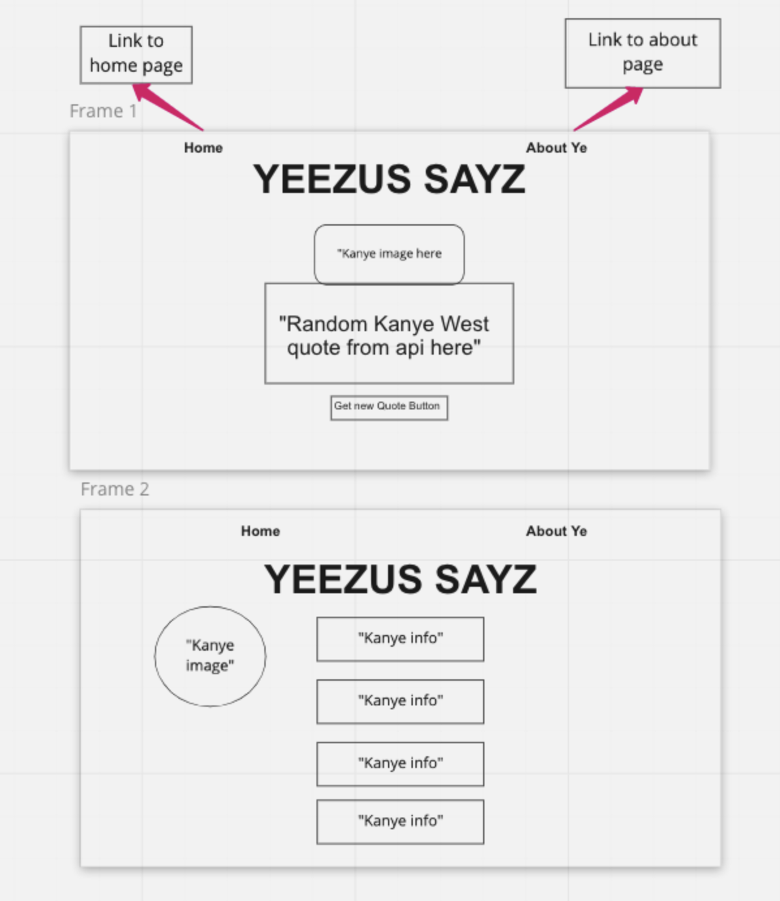

# Yeezus Sayz
## Project Description
Yeezus Sayz is an affirmation app that displays random quotes from Yeezus himself. Built with React and an API.

**API Links**
- https://api.kanye.rest/
- https://github.com/ajzbc/kanye.rest

## Project Links
[Deployed site](https://yeezus-sayz.netlify.app/aboutye)

[Repo](https://github.com/tsucodes/yeezus-sayz)
## Wireframes


## User stories
As a user I want to see a homepage that displays a Kanye West quote.
As a user I want to click a button to refresh the quote on the screen.
As a user I want to see a picture of Kanye West.
As a user I want to be able to navigate to the homepage by clicking home no matter where they are in the application.
As a user I want to click About Ye to see a page that contains background information on Kanye west
## MVP 
1. Create a react app and install dependencies
2. Connect API 
3. Set up a components folder and file structure
4. Create a header with a header that includes a home and about ye links.
5. Component that fetches random quote api and passes it down as props.
6. Create a button to refresh random quote
7. Create Kanye image component that renders random Kanye image when quote is refreshed.
8. Create a container component for the about ye page that hold the image and Kanye fact
9. Create Kanye fact components

## POST MVP
1. Connect twitter API for share button
2. Turn did you know ye element into a button that dispalys facts
3. connect twitter API to share quote

```
    const images = [kanye1, kanye2, kanye3, kanye4, kanye5, kanye6, kanye7, kanye8, kanye9, kanye10, kanye11, kanye12, kanye13, kanye14];
    const randomImage = images[Math.floor(Math.random()* images.length)]
```
## Issues and Resolutions
# Error
I struggled with getting my images to render on the virtual Dom
# Resolution 
I was using scr instead of src

